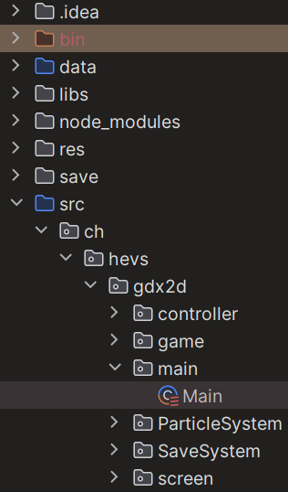

# SOS Invader

## 101.2 - POO Game Project

Inspiré du classique "Space Invader", contrôllez un vaisseau dans l'espace et abattez le plus d'ennemis possible.
Vener découvrir pendant combien de temps vous pouvez tenir face aux vagues d'ennemis seul ou avec un coéquipier.
Si détruire des vaisseaux ennemis ne suffit plus ou ne vous intéresse pas, combattez un ami avec notre mode "1 VS 1".

## Fonctionnalités
Nous proposons plusieurs modes de jeu:
- Le grand classique avec un seul joueur face à une vague continue d'ennemis.
- Une autre version du classique du jeu est le multiplayeur locale de 2 joueurs.
- Et un mode "1 VS 1" pour affronter un autre joueur en locale.

SOS Invader est également compatible manette Xbox.

## Prérequis
Pour lancer le jeu, vous devez posséder un IDE pouvant lire et exécuter des fichiers `.scala`

## Lancement
Copiez l'URL HTTPS du repositories et ouvrez-le dans votre IDE.

Lancer le programme dans le fichier 'main'.

## Instruction de jeu
Le jeu est compatible clavier/manette, mais uniquement durant la partie.

- Commandes clavier
  - W,S : déplacement Joueur 1
  - Flèches directionnelles: déplacement Joueur 2
  - Space : Tire Joueur 1
  - Q : Tire spécial Joueur 1
  - Enter: Tire Joueur 2
  - Backspace: Tire spécial Joueur 2
  - P : pause
  - X : retour au menu depuis l'écran Game Over